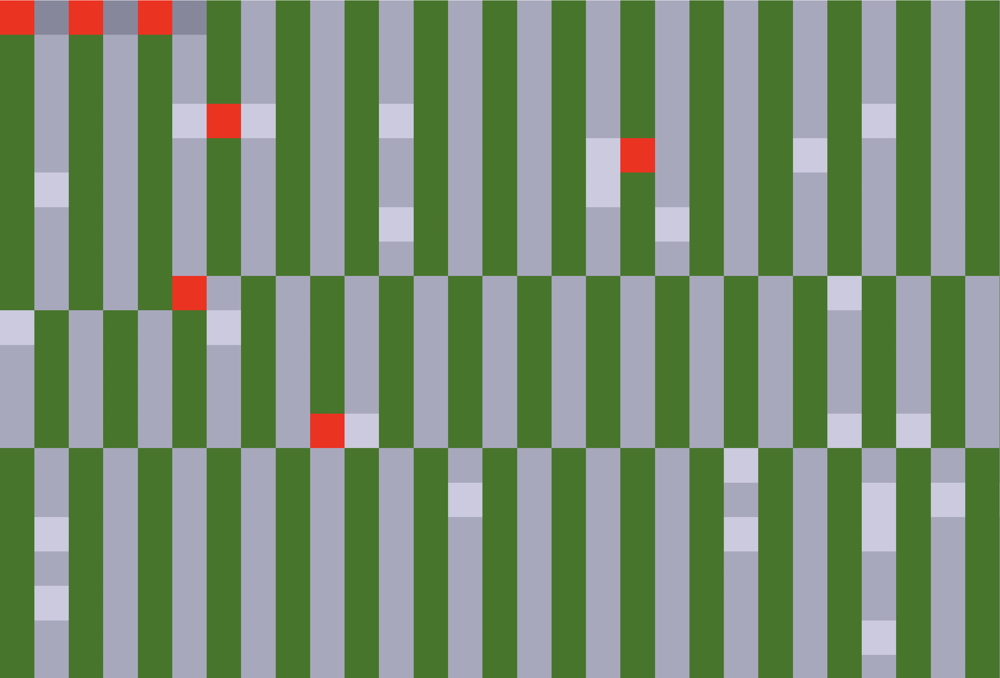
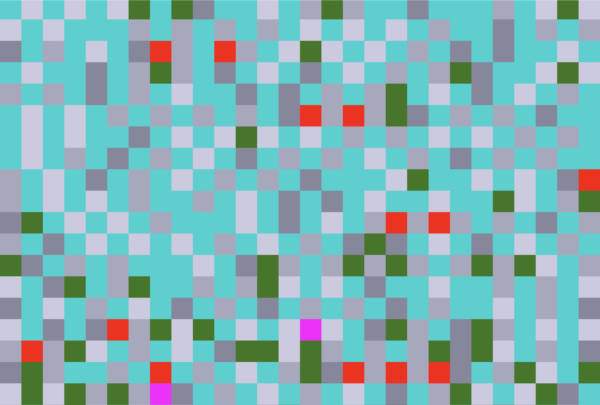
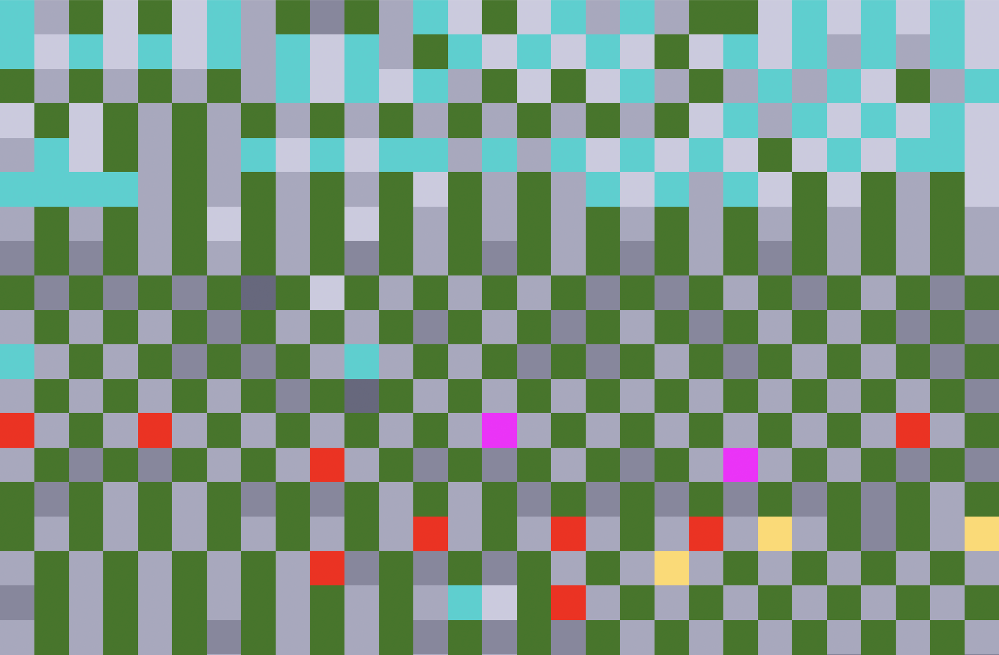
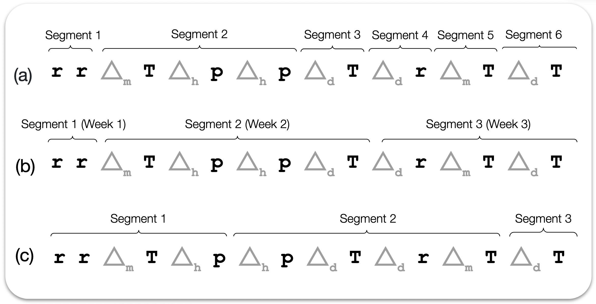
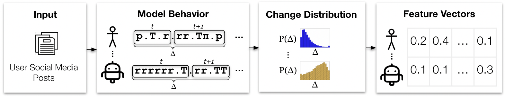

## Behavior Change as a Signal for Identifying Social Media Manipulation

Social media accounts engaging in online manipulation can change their behaviors for re-purposing or to evade detection. Here we investigate the degree to which change in behavior can serve as a signal for identifying automated or coordinated accounts.

The [BLOC](https://github.com/anwala/bloc) (Behavioral Languages for Online Characterization) framework provides formal languages that can be used to represent the behaviors of social media accounts. The BLOC representations in Figure 1 illustrate the behavioral patterns exhibited by different accounts. By analyzing these patterns and how they change over time, we can differentiate between authentic, and inauthentic behaviors. 

<table>
  <tr>
    <td align="center">
      <br>
      <code>@FoxNews</code>
    </td>
    <td align="center">
      <br>
      <code>@elonmusk</code>
    </td>
    <td align="center">
      <br>
      <code>@TEN_GOP</code>
    </td>
  </tr>
</table>

<p align="center" style="max-width:900px; margin:15px auto; font-size:14px; line-height:1.4;">
  <strong>Figure 1:</strong> Color-coding of BLOC action symbols of Twitter accounts to illustrate how their behaviors change (color switches). Each square represents an action. Color legend (non-exhaustive): Green-<b>post</b>, Red-<b>retweet</b>, Cyan<b>reply</b>, Gray-<b>pauses</b> (longer pauses = darker gray)<br>
  (a) <code>@FoxNews</code> exhibits repetitive patterns, reflecting automated activity. <br>
  (b) <code>@elonmusk</code> exhibits a diverse mix of actions without repetitive patterns. <br>
  (c) <code>@TEN_GOP</code>, a Russian troll account, shows sudden shifts between organic-looking and repetitive patterns.
</p>


## Installation

### 1. Download the project
```bash
wget -O behavior_change.zip https://anonymous.4open.science/api/repo/behavioral-change-2414/zip
unzip behavior_change.zip -d behavior_change
cd behavior_change/
```

### 2. (Optional) Create and activate a virtual environment
```bash
python3 -m venv {env_name}
source {env_name}/bin/activate    # Linux/macOS
# myenv\Scripts\activate   # Windows
```

### 3. Install dependencies
```bash
pip install -r requirements.txt
```


## Measuring Change in the Behaviors of Social Media Accounts

To capture behavioral change patterns, we can segment BLOC strings into smaller partitions and compare the segments. 
We explored three segmentation methods as shown in Figure 2. 
In segmentation by **pauses**, a new segment starts after any period of inactivity longer than a predefined threshold (e.g., one hour). Each segment then represents a session of user activity. 
In segmentation by **week**, each segment represents activities that occurred in the same week. 
These two approaches result in BLOC segments of different lengths. 
Alternatively, segmentation by **sets-of-k** partitions the string into sets of equal length $k$. 
And unlike the previous two methods, this one produces segments of BLOC strings of the same length.
While segmentation is based on action strings, for each action segment, we also create a content segment that includes the corresponding content symbols. 

<figure style="text-align:center;">
  
  <figcaption style="font-size:14px; margin-top:8px;">
    <strong>Figure 2 : </strong> Three ways of segmenting a user's BLOC string. 
    This example includes pauses less than an hour (Δh), between an hour and a day (Δd), 
    and between a day and a month (Δm).  
    (a) <em>pauses</em> (longer than one hour).  
    (b) <em>weeks</em>.  
    (c) <em>sets-of-k</em> (k = 4).
  </figcaption>
</figure>

After a user's behavior is partitioned into sequential segments, we must select different segments to be compared for measuring how behavior evolves over time. We explored two selection methods. Consider a sequence of four segments $s_1$, $s_2$, $s_3$, and $s_4$ for illustration. In **adjacent** selection, we compare consecutive segments, e.g., $(s_1 \text{ vs. } s_2)$, $(s_2 \text{ vs. } s_3)$, and $(s_3 \text{ vs. } s_4)$. This method is sensitive to short-term fluctuations in behaviors. In **cumulative** selection, we compare each segment with the concatenation of all prior segments, e.g., $(s_1 \text{ vs. } s_2)$, $(s_1 s_2 \text{ vs. } s_3)$, and $(s_1 s_2 s_3 \text{ vs. } s_4)$. This method captures how present behavior diverges from historical ones.

We measure how an account's behavior evolves over time by computing the differences between selected pairs of segments. We propose two methods to measure these differences. For **cosine** distance, we convert two selected segments into term frequency vectors $v_1, v_2$ and then compute their cosine distance $1 - \cos(v_1, v_2)$. For *compression* distance, we employ the **Normalized Compression Distance (NCD)**. Let $C(\cdot)$ denote the compressed length (in bytes) of a string under a given compressor (e.g., zlib). The NCD between $s_1$ and $s_2$ is defined as:

$$
\text{NCD}(s_1, s_2) =
\frac{C(s_1 s_2) - \min\{C(s_1), C(s_2)\}}
     {\max\{C(s_1), C(s_2)\}}
$$

where $C(s_1 s_2)$ denotes the compressed length of the concatenation of $s_1$ and $s_2$. Intuitively, NCD measures the degree to which the two segments share compressible patterns. Both distance measures are defined in the unit interval.


## Usage/Examples

<div style="text-align: center; width: 100%;">
  
  <div style="font-weight: bold; margin-top: 6px;">
    Figure 3: Overview of the Behavior Change methodology to identify social media manipulation.
  </div>
</div>

<br>

The activities of a social media account are encoded using BLOC, which represents each account as strings of symbols drawn from alphabets that describe actions or content. After encoding, the account’s BLOC strings are segmented, and the behavioral distance between segments are computed based on the selected segmentation and distance measures. These computed values form the behavioral change profile of the account. Two histograms are then constructed to represent action-based and content-based behavioral changes, each containing 10 bins. The resulting histogram is saved in the results folder.

Example 1: 
```bash
python -m src.index --task user_analyzer --config config/user_analyzer_config.yaml > logs/anaylze_users_config.txt
```

Example users are provided in dataset/users. To analyze new accounts, place their tweets in a .gz file and update the configuration file at: config/user_analyzer_config.yaml

### Available change settings:

- **Segmentation method:** *segment_on_pauses*, *sets_of_four*, *week_number*
- **Segment selection method:** *adjacent*, *cumulative*  
- **Distance measure:** *osine-similarity*, *compression* 


## WebSci'26 Paper
The behavioral change models were evaluated on two tasks: detecting automated accounts and detecting coordinated accounts on Twitter. Each task was treated as a supervised machine learning problem, and dedicated Behavior Change models were trained for both automation and coordination detection.

As summarized in Figure 3 and described in Section "Measuring Change in the Behaviors of Social Media Accounts", account activity was represented using BLOC and analyzed through two behavioral change distributions: the distribution of action behavioral distances and the distribution of content behavioral distances. Each distribution was constructed using 10 bins, resulting in a total of 20 behavioral change features per account. These features were used to train and evaluate the machine learning models for each task.

The experiments described above have already been completed. The commands below allow the tasks to be reproduced. Each command runs one task end-to-end and stores the evaluation results in the logs/ directory. Additionally, you can select the segmentation method, segment-selection strategy, and distance measure in the relevant configuration file for each task. You must also add the datasets under the dataset/ folder. The required format for the datasets is provided under each corresponding task, and each dataset must include the list of userIds associated with the accounts being evaluated.

### Automation experiments
```bash
python -m src.index --task retraining_analyzer --config config/retraining_config.yaml > logs/retraining_analysis.txt
```
- dataset
  - retraining_data
    - astroturf
      - tweets.jsons.gz
      - userIds.txt
    - kevin_feedback
    - botwiki

### Fox8 coordination analysis
```bash
python -m src.index --task fox8_analyzer --config config/fox8_config.yaml > logs/fox8.txt
```
- dataset
  - fox8_23_dataset.ndjson.gz

### Information Operations (InfoOps) coordination analysis
```bash
python -m src.index --task infoOps_analyzer --config config/infoOps_config.yaml > logs/infoOps.txt
```
- dataset
  - YYYY_MM
    - campaign_1
      - DriversControl/control_driver_users.csv
      - driver_tweets.csv.gz
    - campaign_2 
